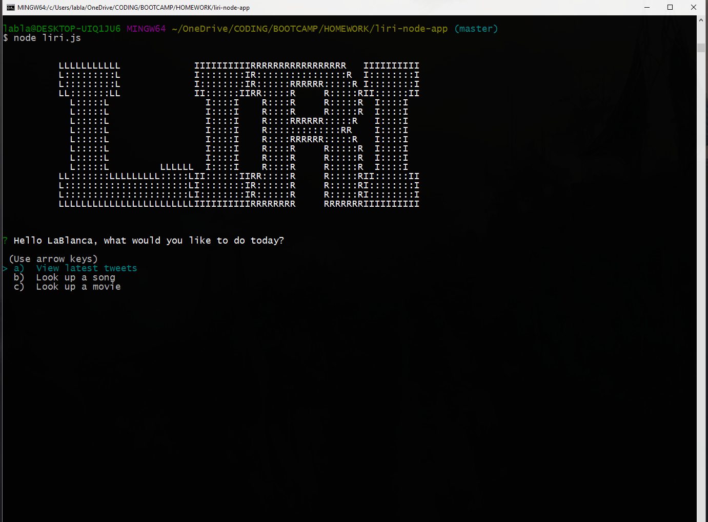
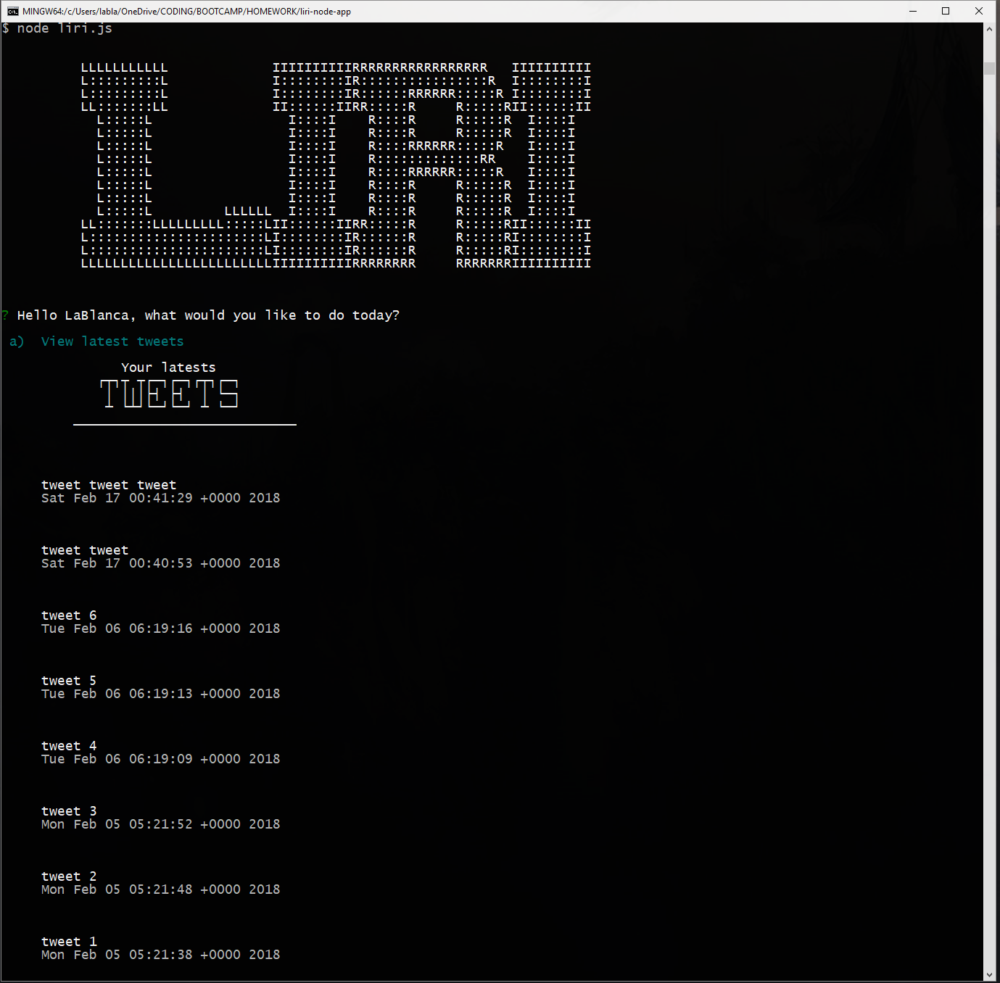
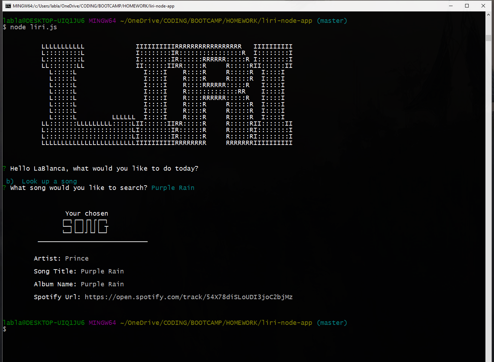
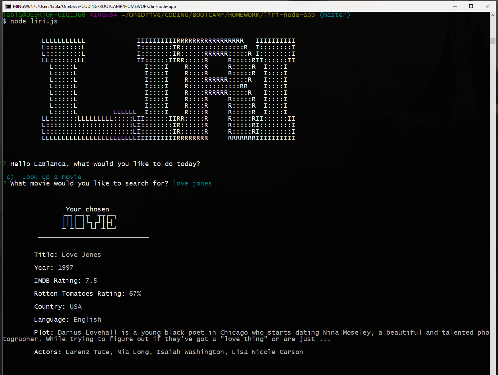

# LIRI

### Liri is SIRI for languages.  It can run the following three commands:

* 20 most recent tweets
* Look up any song by title using Spotify's API
* Display information about any movie by title using IMDB's API

## GitHub Repo: https://github.com/lablancaponder/liri-node-app.git

## Screenshot

## Languages used:

* Javascript
* Node.js
